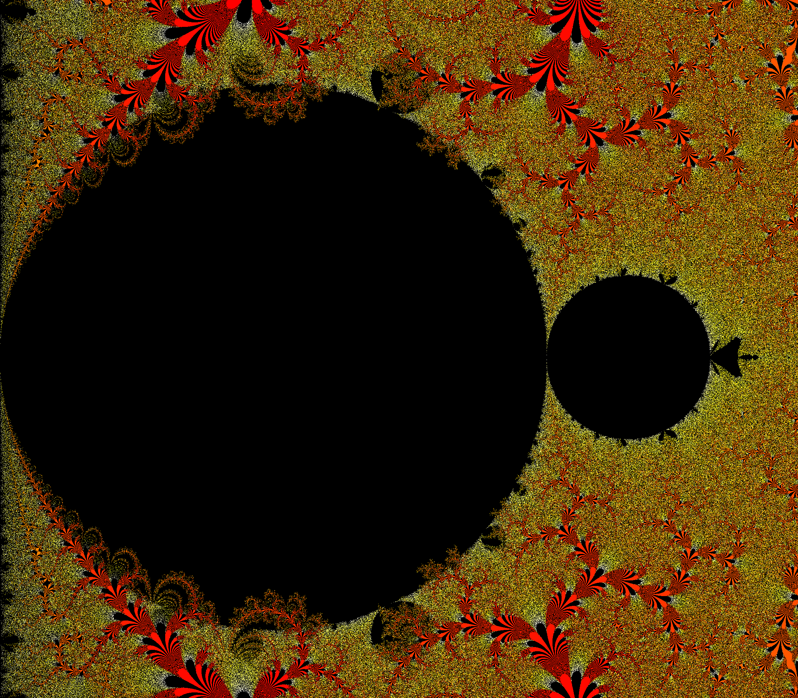

# Fractals

 

Fractals is a simple small project just to explore some interesting fractal maps and iterations methods
not commonly seen around the internet. The code itself is not very well optimized and the colour mappings
are not terribly pretty but it's good enough for an on-the-surface look into some interesting stuff.

The complex-valued functions explored are typically something related to the exponential function e^z or 
certain interesting rational functions like z^2*(1-z)/(1-z^2). Aside from the normal simple iteration

`Zn+1 -> f(Zn)` where `Z0=c`

and Mandelbrot-style iteration

`Zn+1 -> f(Zn) + c`

we will also explore some other interesting types such as iteration with feedback

`Zn+2 -> f(Zn+1) + Zn` where `Z0=0`

and iteration alternating between multiple functions

`Zn+1 -> f1(Zn) when n % 2 == 0 else Zn+1 -> f2(Zn)`

### The fractals

The simple and mandelbrot-style 

With feedback

Alternating functions

### Short look into the code

The iteration methods and everything else related to creating the images are in the Util object. The basic
idea is to create a desired size grid of complex values representing coordinates of the pixels on the screen. Next, 
iteration methods are applied on the values of the grid producing another grid which holds the results of the iteration. 
The results are basically just integers representing the amount of iterations it took to reach infinity or just 0 if 
the iteration converged. Next, the pixels are painted with a certain color corresponding to the result producing a 
png file.

The iteration function are quite simple. For example, the normal mandelbrot-style iteration with a desired
function f and the desired maximum number of iterations is as follows:

```scala
def iterate_m(c: Complex, f: Complex => Complex, maxIter: Int = 1000): Int = {
    var s: Complex = c

    for (n <- 0 until maxIter){
      s = f(s) + c
      if (s.re.isInfinity || s.imag.isInfinity) return n
    }

    0
  }
```

Obviously, there is no optimization such as stopping the iteration if some fixed point or other bailout condition
is reached. For example, for the mandelbrot set we could already stop the iteration after abs(Z)>2. This is quite fine 
for a simple on-the-surface look since most of the time the iteration blows up to infinity very quickly.

The pixels are coloured according to a simple logarithmic scale palette

```scala
def getColor(iter: Int, maxIter: Int):Color ={

    val c = 3 * log(iter) / log(maxIter - 1.0)

    if ( c < 1) new Color((255 * c).toInt, 0, 0)
    else if (c < 2) new Color(255, (255*(c - 1)).toInt, 0)
    else new Color(255, 255, (255*(c - 2)).toInt)
} 
```

Creating the images with a desired function is quite simple. Here's an example of the exponential function in the range
x=[-0.1,0.1] and y=[0.2,0.3] with mandelbrot-style iteration creating an image of base-size of 2000 pixels

```scala
grid = getGrid(2000, -0.1,0.1,0.2,0.3)
imageArray = grid.par.map(_.map(iterate_m(_, (c: Complex) => exp(c))))
createImage(imageArray, 1000, "exponential_m1")
```

 

### Some examples

The normal mandelbrot set `Z -> Z + c`

 


Exponential function `Z -> exp(Z) + C` with mandelbrot-style iteration
 


Mandelbrot-style iteration alternating between `Z -> Z^2` and `Z -> i*Z^2`
